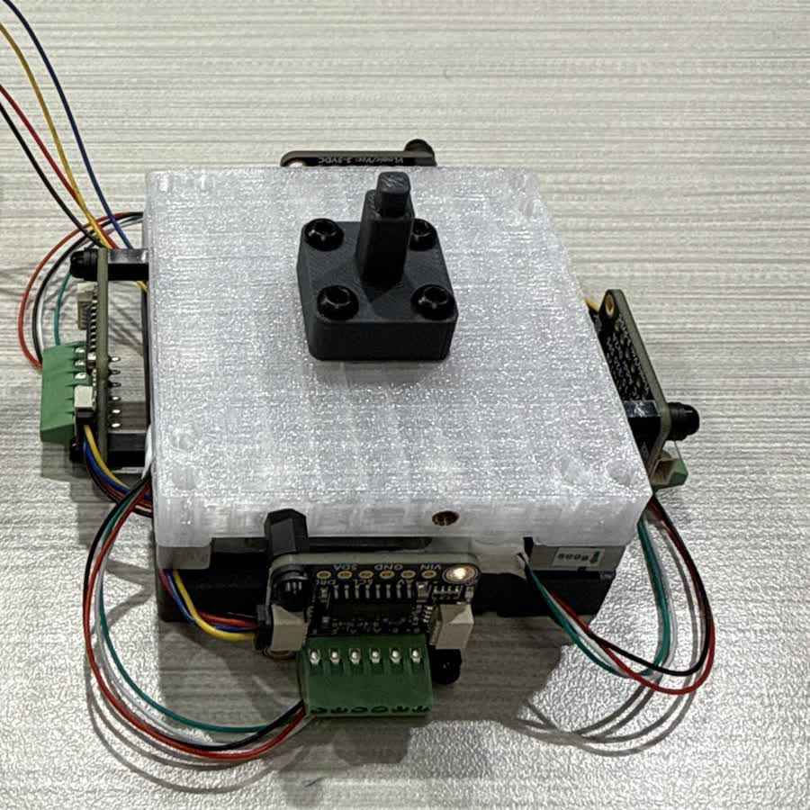
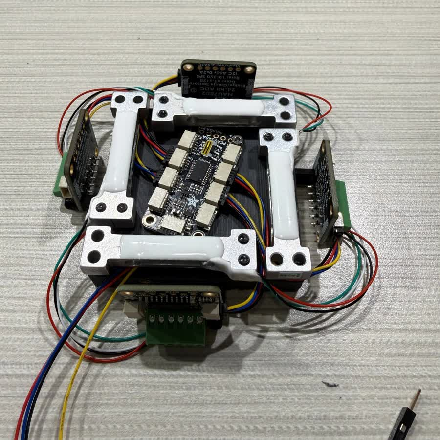
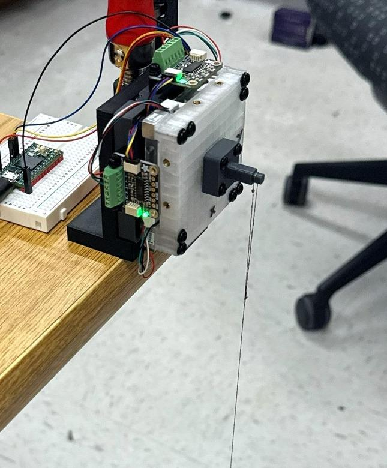
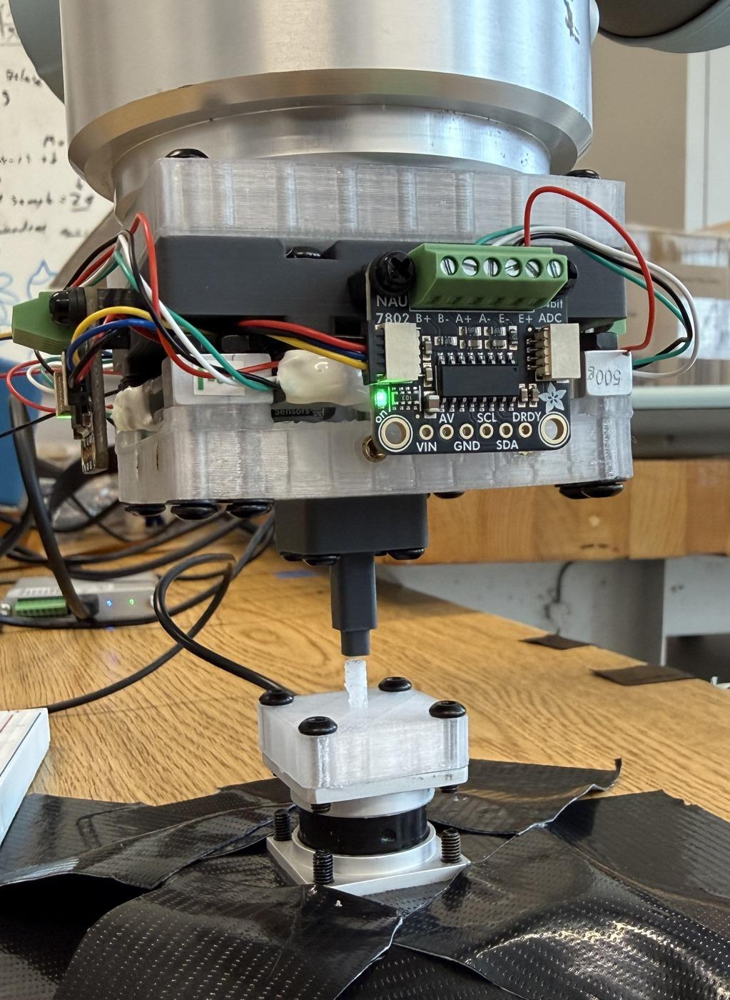
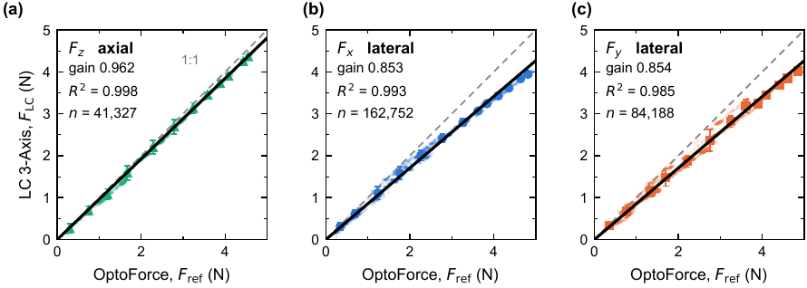
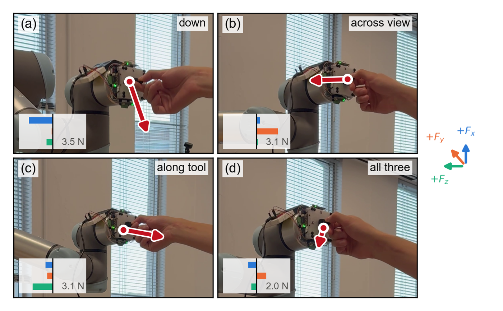

# An Accurate Three-Axis Force Sensor Assembled with Readily Available Off-the-Shelf Components with No Designed Compliant Element

Lucas Feng, Ariel Slepyan, Krishna Murthy, Nitish Thakor — Johns Hopkins University
IROS 2026 Workshop on Sensors and Actuators for Dexterous Manipulation

**Project page with the video: [lucasfeng7.github.io/lc-3-axis](https://lucasfeng7.github.io/lc-3-axis/)**

## Abstract

Affordable multi-axis force sensors are usually designed with a custom
compliant part, and the deformation of that part is measured after a load is
applied. Any creep, hysteresis, or thermal sensitivity in that part then
becomes a property of the finished sensor. Its accuracy then depends on
operating temperature and load history in ways a single calibration cannot
capture. We instead developed a sensor using four commercial load cells that
are manufacturer-characterized to carry the full load. On top of the
mechanical design, one fitted matrix that maps readings to force accounts for
assembly tolerances, gain differences, and wiring polarity. The resulting
three-axis sensor costs under \$120 and has a 2.6–3.5 mN noise floor. Off-axis
leakage remains below 1 %, and lateral hysteresis remains below 0.5 % of span.
After one scale factor, its output agrees with a commercial reference to
1.0–2.5 % of full scale across more than 300,000 in-contact samples. The
design suits tools whose contact point is known and makes an accurate
three-axis sensor accessible to any research lab with a 3D printer.

<p align="center">
  
  
</p>
<p align="center"><sub>The sensor as designed and as built. Left, the assembled body with the interchangeable tip. Right, the four load cells that form the structure, with the converters on the perimeter and the I&sup2;C multiplexer at the center.</sub></p>

---

## Introduction

Force sensing is critical in any task where a robot meets a surface it cannot
fully model. Commercial multi-axis sensors do this well but cost tens of
thousands of dollars, which has pushed a research effort toward cheaper
designs.

Those low-cost designs have used optical readout, cameras and fiducials,
capacitance, and light transmitted through an elastomer. In each case an
inexpensive sensor measures a compliant structure built for that device. The
structure determines range and sensitivity, and it also adds creep,
hysteresis, and temperature dependence. These effects are seldom characterized
in full. Hysteresis is sometimes reported, but creep and temperature
dependence usually are not, so a user cannot predict the error under a
sustained load, under load cycling, or at a different operating temperature.

The four-cell arrangement already exists in a design by Chua and Okamura,
which places four commercial point-contact cells around a PCB perimeter [5].
That design needs a custom PCB, which makes it far less readily available and
much more expensive. Ours keeps the cost low and the error terms quantifiable
while using only off-the-shelf parts. The load cells serve as both beams and
transducers. Their beam geometry, strain-gauge placement and bridge
compensation are set at manufacture, and the creep and temperature behavior
that follows is specified on the datasheet [6], so no separate part needs its
own characterization.

---

## Method

### Sensor structure

Four TAL221 500 g bar load cells connect the two 3D-printed plates in a
square. Each senses compression along the vertical axis. Together they
respond to `Fz`, `Mx`, and `My`. The remaining combination is the self-stress
mode, a pattern of internal cell forces that cannot be produced by an external
load.

Each load cell has its own NAU7802 converter, interleaved through an I&sup2;C
multiplexer for an aggregate output of about 1200 Hz. The multiplexer connects
to a Teensy 4.0, though any reasonably capable microcontroller would serve.

A lateral force is recovered from its moment about the cell plane. For a
contact at `(xc, yc)` and height `h`,

```
My = -Fx·h + Fz·xc
Mx =  Fy·h - Fz·yc
```

The contact location must therefore be known. For the tests reported here,
the contact face lies 38.6 mm above the cell mid-plane.

We tare each channel before loading to remove the assembly preload and the
weight of the parts above the cells. A fitted 3×4 matrix with a bias converts
a four-entry vector of tared counts into `(Fx, Fy, Fz)`. The same fit absorbs
placement error, cell-to-cell gain variation, polarity, and cross-coupling.
Firmware identifies the multiplexer channel used by each converter, so the
physical cell order does not matter.

### Fabrication

Only three of the seventeen part types are custom. They are two FDM
3D-printed PLA plates and an interchangeable printed tip. The load cells,
converters, multiplexer, and microcontroller cost \$116.55 in total.
Fasteners, cabling, and filament are excluded. The bill of materials,
firmware and calibration procedure are below.

---

## Experiment

### Sensor characterization

We calibrated against known masses rather than another force sensor. For each
lateral axis the sensor was clamped horizontal, so gravity acted perpendicular
to the axis being loaded.

<p align="center">
  
  
</p>
<p align="center"><sub>The two calibrations. Left, the sensor clamped axis-horizontal at the bench edge with known masses hanging from the tip, so gravity loads it perpendicular to the sensing axis. Right, the two instruments in series on the UR5e, the sensor on the flange and the OptoForce below it, so each carries the same force.</sub></p>

<div align="center">

| | Fx | Fy | Fz |
|---|---|---|---|
| Leave-one-out error (N) | 0.0431 | 0.0330 | 0.0357 |
| Noise floor, 1σ (mN) | 3.2 | 3.5 | 2.6 |
| On-axis decoupling (%) | 100.1 | 99.7 | 99.6 |
| Hysteresis (% of span) | 0.111 | 0.421 | 1.112 |

<sub>Bench behavior, calibrated range 0&ndash;4.9 N.</sub>

</div>

Leave-one-out error stays below 0.9 % of range on every axis. Residuals
measured in sample are 2.2 times smaller. On-axis decoupling is close to a
full response on every axis, and the Fx entry sits just above it because of a
small overshoot in the estimate. Leakage onto the other two axes stays below
1 %. Hysteresis is 0.111 % and 0.421 % of span laterally.

We applied three overloads of 19.9–28.7 N against the 19.6 N limit. After
each, the unloaded output returned to within 0.05 N of zero. A different
load-cell rating changes the range without changing the design.

### Independent validation

For validation, the UR5e carried two independently calibrated instruments in
a serial stack. Their coordinate frames were aligned with an orthogonal
transform. The data contain 344,424 in-contact samples.

<p align="center">
  
</p>
<p align="center"><sub>Response against the OptoForce reference with both instruments in series on the same rig. Dashed gray is the 1:1 line and black is a least-squares fit through the origin. Markers are slice means with their standard deviation.</sub></p>

Allowing one scale factor per axis, the readings sit within 0.1137 N of the
reference on Fx and 0.1211 N on Fy, which is 2.32 % and 2.47 % of the 4.9 N
range. The two rise together in a straight line, at r² ≥ 0.993. For Fz we
pressed in steps of increasing force along the tool axis, where the readings
sit within 0.0480 N, or 0.98 %, at r² = 0.998. The scale factors themselves
are 0.865 and 0.873 laterally and 0.953 axially. What separates them is
scale, not scatter and not nonlinearity. The likely cause is that the robotic
arm was controlled manually during the comparison, which varies the contact
height and therefore the lever arm.

Even so, these figures match or exceed the closest comparable design. Both
are the RMS disagreement with an independent reference after per-axis
calibration constants are fitted. Ours are 0.1137 and 0.1211 N laterally and
0.0480 N axially. Chua and Okamura report 0.105 to 0.146 N laterally and
0.064 to 0.126 N axially, the spread being across the two units they built
[5].

### Sensor applications

Finally, we used the sensor for admittance hand-guiding. In this control
mode, the measured contact force commands the robot's Cartesian velocity. The
loop runs at 199.8 Hz. It responds to single-axis pushes and to simultaneous
loading of all three axes, which confirms that the sensor is fast and
accurate enough to close a control loop on a moving robot rather than only on
a bench.

<p align="center">
  
</p>
<p align="center"><sub>The sensor driving admittance hand-guiding on the UR5e. Four instants from one run, with the components measured at each instant inset on a common 4.9 N scale. Panel (a) is a push down, (b) across the view, (c) along the tool, and (d) loads all three axes at once.</sub></p>

Full video: [`media/handguiding.mp4`](media/handguiding.mp4).

---

## Conclusion

We presented a three-axis force sensor which leverages four load cells as the
structure. The sensor does not need a custom PCB and is simple to assemble,
and it agrees with a commercial reference to 1.0–2.5 % of full scale. It
matches or exceeds the accuracy of the closest comparable design, which makes
it an affordable and easy-to-implement option for research labs that need
accurate three-axis force sensing.

---

## Bill of materials

Total **\$116.55** for the electromechanical parts below. Fasteners, cabling
and filament are excluded.

| Qty | Part | Role |
|---|---|---|
| 4 | TAL221 500 g bar load cell | the structure and the transducer, both |
| 4 | NAU7802 24-bit ADC breakout | one per cell, I²C address `0x2A` |
| 1 | TCA9548A I²C multiplexer | address `0x70`, A2:A0 to GND |
| 1 | Teensy 4.0 | reads the cells, applies the matrix, streams CSV |

Three part types are custom out of seventeen, and all three are FDM 3D printed.

| Part | Process | Notes |
|---|---|---|
| Upper plate | FDM, PLA | carries the tip &mdash; [`Top Plate.SLDPRT`](cad/Top%20Plate.SLDPRT) |
| Lower plate | FDM, PLA | bolts to the robot flange &mdash; [`Bottom Plate.SLDPRT`](cad/Bottom%20Plate.SLDPRT) |
| Interchangeable tip | FDM, PLA | sets contact height `h`, 38.6 mm here &mdash; [`Calibration Tip.SLDPRT`](cad/Calibration%20Tip.SLDPRT) |

No custom PCB. No machining. No cast or molded elastomer.

---

## Firmware

[`firmware/lc_3_axis.ino`](firmware/lc_3_axis.ino) runs on the Teensy 4.0. It
discovers the multiplexer channels at boot, stores the calibration matrix and
the discovered channel map together in EEPROM, and refuses to load a
calibration whose map does not match the hardware present.

Libraries are Adafruit NAU7802 and Adafruit BusIO. I²C runs at 400 kHz on pins
18 and 19, with each ADC at gain 128 and 320 SPS.

Serial at 115200, newline endings. Output is plain CSV in newtons.

```
0.0142,-0.0031,1.9847
```

| key | does |
|---|---|
| `t` | re-tare, since zero drifts with temperature and the matrix does not |
| `r` | stream Fx, Fy, Fz |
| `p` | pause |
| `d` | also show the four raw cell counts |
| `u` | switch newtons and gram-force |

Lines beginning `#` are messages rather than data, so filter them when parsing.

---

## CAD

SolidWorks source for the printed parts is in [`cad/`](cad/):

| File | Part |
|---|---|
| [`LC 3-Axis.SLDASM`](cad/LC%203-Axis.SLDASM) | top-level assembly |
| [`Top Plate.SLDPRT`](cad/Top%20Plate.SLDPRT) | upper plate |
| [`Bottom Plate.SLDPRT`](cad/Bottom%20Plate.SLDPRT) | lower plate |
| [`Calibration Tip.SLDPRT`](cad/Calibration%20Tip.SLDPRT) | interchangeable tip used for calibration, `h` = 38.6 mm |

The two plates and the tip are simple FDM parts; the geometry that matters is
the contact height `h`, given above. The assembly references the load cells,
converters and fasteners as toolbox/purchased components, which are not
included as separate files.

---

## References

[1] R. Ouyang and R. D. Howe, "Low-cost fiducial-based 6-axis force-torque
sensor," in *IEEE International Conference on Robotics and Automation
(ICRA)*, 2020, pp. 1–7.

[2] N. Hendrich, F. Wasserfall, and J. Zhang, "3D printed low-cost
force-torque sensors," *IEEE Access*, vol. 8, pp. 140569–140585, 2020.

[3] H. Choi et al., "CoinFT: A coin-sized, capacitive 6-axis force torque
sensor," *arXiv preprint arXiv:2503.19225*, 2025.

[4] A. El-Azizi, S. Islam, P. Piacenza, I. Kymissis, and M. Ciocarlie, "A
compact, low-cost force and torque sensor for robot fingers with LED-based
displacement sensing," *arXiv preprint arXiv:2410.03481*, 2024.

[5] Z. Chua and A. M. Okamura, "A modular 3-degrees-of-freedom force sensor
for robot-assisted minimally invasive surgery research," *Sensors*, vol. 23,
no. 11, p. 5230, 2023.

[6] HTC Sensor, "TAL221 miniature load cell datasheet,"
https://cdn.sparkfun.com/assets/9/9/a/f/3/TAL221.pdf, 2024, creep &plusmn;0.05 %
of full scale over 3 min, compensated temperature range &minus;20 to +60&nbsp;&deg;C.

---

## Citation

```
@inproceedings{feng2026lc3axis,
  title     = {An Accurate Three-Axis Force Sensor Assembled with Readily Available Off-the-Shelf Components with No Designed Compliant Element},
  author    = {Feng, Lucas and Slepyan, Ariel and Murthy, Krishna and Thakor, Nitish},
  booktitle = {IROS 2026 Workshop on Sensors and Actuators for Dexterous Manipulation},
  year      = {2026}
}
```

---

## License

MIT. See [LICENSE](LICENSE).
