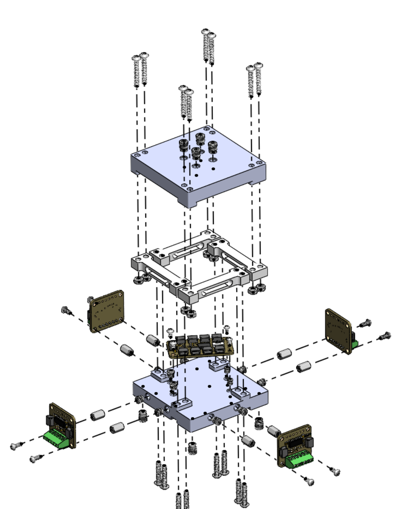

# An Accurate Three-Axis Force Sensor Assembled with Readily Available Off-the-Shelf Components with No Designed Compliant Element

**Project page with the video: [lucasfeng7.github.io/lc-3-axis](https://lucasfeng7.github.io/lc-3-axis/)**

Four off-the-shelf load cells carry the entire load path. There is no custom
flexure, so the creep, hysteresis and temperature compensation that dominate
the error budget of a low-cost force sensor are inherited from a mass-produced
part instead of being introduced by one we would have to characterize
ourselves.

Millinewton resolution, a \$116.55 bill of materials, and nothing in the build
that has to be made accurately.

<p align="center">
  
  
</p>

---

## Measured performance

Calibrated range is 0 to 4.9 N on every axis.

| | Fx | Fy | Fz |
|---|---|---|---|
| Leave-one-out error (N) | 0.0431 | 0.0330 | 0.0357 |
| Noise floor, 1σ (mN) | 3.2 | 3.5 | 2.6 |
| On-axis decoupling (%) | 100.1 | 99.7 | 99.6 |
| Hysteresis (% of span) | 0.111 | 0.421 | 1.112 |

Leave-one-out means each calibration point is predicted by a fit made without
it. In-sample residuals are 2.2 times smaller. The conservative number is the
one quoted.

Off-axis leakage stays below 1 percent. Three overloads of 19.9 to 28.7 N
against a 19.6 N rated limit each returned to zero within 0.05 N, so the range
is a purchasing decision rather than a redesign.

Each converter runs at 320 SPS, so the four interleaved give roughly
1200 samples per second in aggregate. A frame carrying fresh data from all
four cells is emitted at 212 Hz.

---

## Against a commercial reference

Compared against an OptoForce, both instruments in series on a UR5e so each
carries the same contact force, over 344,424 in-contact samples.

<p align="center">
  
</p>

| axis | gain | r² | residual about the gain |
|---|---|---|---|
| Fz | 0.953 | 0.998 | 0.0480 N, 0.98 % of range |
| Fx | 0.865 | 0.993 | 0.1137 N, 2.32 % of range |
| Fy | 0.873 | 0.993 | 0.1211 N, 2.47 % of range |

Tracking is close. Absolute scale is not. The disagreement is a fixed gain
rather than noise or nonlinearity, so a controller absorbs it without losing
resolution or repeatability. The likely cause is that the arm was moved by hand
during the comparison, which varies the contact height and so the lever arm the
lateral force is computed through. The absolute tip height was never measured.

The two frames were aligned with an orthogonal transform rather than a general
3×3 fit. A general fit would have recalibrated the sensor against the reference
and then reported the agreement it had just produced.

---

## Closing a loop on a robot

The sensor drives admittance hand-guiding on a UR5e at 199.8 Hz. The operator
pushes the tool and the measured force commands Cartesian velocity.

<p align="center">
  
</p>

Pushes along a single axis and pushes that load all three at once are resolved
alike. Mounting on the moving arm raises the noise floor three to four times
above the bench.

The full run is in [`media/handguiding.mp4`](media/handguiding.mp4), 44 seconds,
and the four instants above are taken from it. The four panels correspond to
roughly 18, 25, 29 and 33 seconds in. Audio is removed and the video is
downscaled from the 4K original, which is why it is 3 MB rather than 135 MB.

---

## Bill of materials

Total **\$116.55** for the electromechanical parts below. Fasteners, cabling
and filament are excluded.

| Qty | Part | Role |
|---|---|---|
| 4 | TAL221 500 g bar load cell | the structure and the transducer, both |
| 4 | NAU7802 24-bit ADC breakout | one per cell, I²C address `0x2A` |
| 1 | TCA9548A I²C multiplexer | address `0x70`, A2:A0 to GND |
| 1 | Teensy 4.0 | reads the cells, applies the matrix, streams CSV |

Three part types are custom out of seventeen, and all three are FDM 3D printed.

| Part | Process | Notes |
|---|---|---|
| Upper plate | FDM, PLA | carries the tip |
| Lower plate | FDM, PLA | bolts to the robot flange |
| Interchangeable tip | FDM, PLA | sets contact height `h`, 38.6 mm here |

No custom PCB. No machining. No cast or molded elastomer.

---

## How it works

Four vertical cells sense exactly three things, `Fz`, `Mx` and `My`. A lateral
force is recovered from the moment it makes about the plane of the cells. For a
contact at `(xc, yc)` and height `h` above that plane,

```
My = -Fx·h + Fz·xc
Mx =  Fy·h - Fz·yc
```

so the contact point has to be known. That suits a probe with fixed tip
geometry rather than a general-purpose contact plate.

A single 3×4 matrix with bias maps four tared cell counts to `(Fx, Fy, Fz)`.
The same fit absorbs placement error, cell-to-cell gain variation, wiring
polarity and cross-coupling, which is why nothing has to be built accurately,
only repeatably. Firmware discovers which multiplexer channel each converter
answers on at boot, so the physical cell order does not matter, and it refuses
to load a calibration whose channel map does not match the hardware present.

Four cells give four readings, but an external load can only produce three
independent patterns among them. The fourth is a self-stress mode, an internal
pattern no external force can excite, and nothing in calibration ever touches
it. Ridge regularization holds its weight near zero rather than letting cell
noise be amplified through it.

---

## Calibration

Calibration is anchored to known masses, not transferred from another sensor.

<p align="center">
  
  
</p>

For the lateral axes the sensor is clamped axis-horizontal at the bench edge
and masses hang from the tip, so gravity loads the sensing axis perpendicular
by construction. Near 90° the projection derivative is zero, so a small angular
error changes the applied force only to second order. That is the least
error-sensitive geometry available without a fixture.

---

## Known limitations

Stating these is the point of the project, so they are not buried.

- **The lateral scale factor of about 0.87 is not attributed.** Two candidate
  causes are bounded out. It is a fixed gain, so it folds into a controller
  gain, but it is unexplained.
- **The stack has no preload.** Under lateral load the printed plates lift
  slightly rather than sharing load linearly, giving a 15 to 20 percent
  difference between loading and unloading. The fix is mechanical and has been
  identified. Applying it would invalidate the calibration behind the
  comparison above, so it is deferred.
- **Three axes only, and only for a known contact point.** This is a probe, not
  a plate.
- **The Fz gain has not reproduced between sessions**, 1.052 on one day against
  0.953 on another, so 9 percent is the current reproducibility limit of the
  comparison rather than 1 percent.

---

## Prior work

The four-cell arrangement is not new. Chua and Okamura pair commercial load
cells with a moment-balance matrix and likewise avoid a custom flexure, but
their cells are point-contact dies soldered around a custom PCB perimeter and
preloaded against a machined stainless plate, so the cells read a structure
they do not form, and the assembly needs shimming to equalize them. Other
low-cost designs use optical, fiducial, capacitive or elastomer-transmitted
readouts, and in each case an inexpensive readout measures a compliant
structure built for that device.

What is different here is that the purchased cells *are* the structure.

---

## Firmware

[`firmware/lc_3_axis.ino`](firmware/lc_3_axis.ino) runs on the Teensy 4.0. It
discovers the multiplexer channels at boot, stores the calibration matrix and
the discovered channel map together in EEPROM, and refuses to load a
calibration whose map does not match the hardware present.

Libraries are Adafruit NAU7802 and Adafruit BusIO. I²C runs at 400 kHz on pins
18 and 19, with each ADC at gain 128 and 320 SPS.

Serial at 115200, newline endings. Output is plain CSV in newtons.

```
0.0142,-0.0031,1.9847
```

| key | does |
|---|---|
| `t` | re-tare, since zero drifts with temperature and the matrix does not |
| `r` | stream Fx, Fy, Fz |
| `p` | pause |
| `d` | also show the four raw cell counts |
| `u` | switch newtons and gram-force |

Lines beginning `#` are messages rather than data, so filter them when parsing.

---

## CAD

SolidWorks source for the printed parts is in [`cad/`](cad/):

| File | Part |
|---|---|
| [`LC 3-Axis.SLDASM`](cad/LC%203-Axis.SLDASM) | top-level assembly |
| [`Top Plate.SLDPRT`](cad/Top%20Plate.SLDPRT) | upper plate |
| [`Top Plate Smaller.SLDPRT`](cad/Top%20Plate%20Smaller.SLDPRT) | upper plate, smaller variant |
| [`Calibration Tip.SLDPRT`](cad/Calibration%20Tip.SLDPRT) | interchangeable tip used for calibration, `h` = 38.6 mm |

The two plates and the tip are simple FDM parts; the geometry that matters is
the contact height `h`, given above. The assembly references the load cells,
converters and fasteners as toolbox/purchased components, which are not
included as separate files.

---

## Paper

> L. Feng, A. Slepyan, K. Murthy and N. Thakor. *An Accurate Three-Axis Force Sensor Assembled with Readily Available Off-the-Shelf Components with No Designed Compliant Element.*
> IROS 2026 Workshop on Sensors and Actuators for Dexterous Manipulation.

Every number in the paper is traced to a source file. Nothing is quoted that
was not measured.

---

## License

MIT. See [LICENSE](LICENSE).
