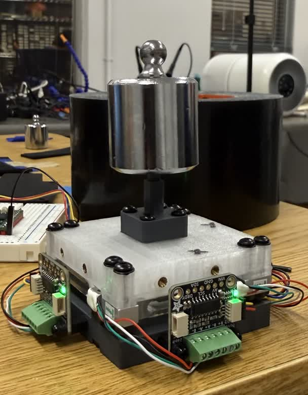

# LC 3-Axis

An accurate three-axis force sensor assembled from off-the-shelf load cells,
with no custom compliant element. Four commercial load cells carry the entire
load path, so the creep, hysteresis, and temperature behavior that would
normally come from a custom-built flexure are instead specified on a
datasheet.

Lucas Feng, Ariel Slepyan, Krishna Murthy, Nitish Thakor — Johns Hopkins
University

**[Paper (PDF)](paper/lc-3-axis-iros2026.pdf)** &middot;
**[Project page](https://lucasfeng7.github.io/lc-3-axis/)** &middot;
**[License](LICENSE)** (MIT)

<p align="center">
  
  
</p>

---

## Specs

| | |
|---|---|
| Calibrated range | 0&ndash;4.9 N, all axes |
| Noise floor, 1&sigma; | 2.6&ndash;3.5 mN |
| Off-axis leakage | < 1 % |
| Agreement with a commercial reference | 1.0&ndash;2.5 % of full scale |
| Bill of materials | \$116.55 |

Full measurements, validation methodology, and comparison to prior work are
in the [paper](paper/lc-3-axis-iros2026.pdf).

---

## Bill of materials

Total **\$116.55** for the electromechanical parts below. Fasteners, cabling
and filament are excluded.

| Qty | Part | Role |
|---|---|---|
| 4 | TAL221 500 g bar load cell | the structure and the transducer, both |
| 4 | NAU7802 24-bit ADC breakout | one per cell, I²C address `0x2A` |
| 1 | TCA9548A I²C multiplexer | address `0x70`, A2:A0 to GND |
| 1 | Teensy 4.0 | reads the cells, applies the matrix, streams CSV |

Three part types are custom, and all three are FDM 3D printed.

| Part | Process | Notes |
|---|---|---|
| Upper plate | FDM, PLA | carries the tip &mdash; [`Top Plate.SLDPRT`](cad/Top%20Plate.SLDPRT) |
| Lower plate | FDM, PLA | bolts to the robot flange &mdash; [`Bottom Plate.SLDPRT`](cad/Bottom%20Plate.SLDPRT) |
| Interchangeable tip | FDM, PLA | sets contact height `h`, 38.6 mm here &mdash; [`Calibration Tip.SLDPRT`](cad/Calibration%20Tip.SLDPRT) |

No custom PCB. No machining. No cast or molded elastomer.

---

## How it works

Four vertical load cells respond to `Fz`, `Mx`, and `My`. A lateral force is
recovered from its moment about the cell plane: for a contact at `(xc, yc)`
and height `h` above the cells,

```
My = -Fx·h + Fz·xc
Mx =  Fy·h - Fz·yc
```

so the contact location has to be known — this design suits a probe with
fixed tip geometry rather than a general-purpose contact plate. A fitted
3×4 matrix with a bias converts the four tared cell counts into
`(Fx, Fy, Fz)`, absorbing placement error, cell-to-cell gain variation, and
wiring polarity. Firmware identifies which multiplexer channel each
converter answers on at boot, so physical cell order doesn't matter.

---

## Calibrating

Calibrate against known masses rather than another sensor:

1. **Lateral axes (Fx, Fy):** clamp the sensor axis-horizontal at a bench
   edge and hang known masses from the tip, so gravity loads the sensing
   axis perpendicular by construction.
2. **Axial axis (Fz):** stack a known mass directly on the tip.
3. Fit the 3×4 calibration matrix against the tared cell counts at each
   load.
4. (Optional) validate against an independent reference — we used an
   OptoForce in series on a UR5e.

<p align="center">
  
  
  
</p>

---

## Firmware

[`firmware/lc_3_axis.ino`](firmware/lc_3_axis.ino) runs on the Teensy 4.0. It
discovers the multiplexer channels at boot, stores the calibration matrix and
the discovered channel map together in EEPROM, and refuses to load a
calibration whose map does not match the hardware present.

Libraries are Adafruit NAU7802 and Adafruit BusIO. I²C runs at 400 kHz on pins
18 and 19, with each ADC at gain 128 and 320 SPS.

Serial at 115200, newline endings. Output is plain CSV in newtons.

```
0.0142,-0.0031,1.9847
```

| key | does |
|---|---|
| `t` | re-tare, since zero drifts with temperature and the matrix does not |
| `r` | stream Fx, Fy, Fz |
| `p` | pause |
| `d` | also show the four raw cell counts |
| `u` | switch newtons and gram-force |

Lines beginning `#` are messages rather than data, so filter them when parsing.

---

## CAD

SolidWorks source for the printed parts is in [`cad/`](cad/):

| File | Part |
|---|---|
| [`LC 3-Axis.SLDASM`](cad/LC%203-Axis.SLDASM) | top-level assembly |
| [`Top Plate.SLDPRT`](cad/Top%20Plate.SLDPRT) | upper plate |
| [`Bottom Plate.SLDPRT`](cad/Bottom%20Plate.SLDPRT) | lower plate |
| [`Calibration Tip.SLDPRT`](cad/Calibration%20Tip.SLDPRT) | interchangeable tip used for calibration, `h` = 38.6 mm |

The assembly references the load cells, converters and fasteners as
toolbox/purchased components, which are not included as separate files.

---

## Citation

```
@inproceedings{feng2026lc3axis,
  title     = {An Accurate Three-Axis Force Sensor Assembled with Readily Available Off-the-Shelf Components with No Designed Compliant Element},
  author    = {Feng, Lucas and Slepyan, Ariel and Murthy, Krishna and Thakor, Nitish},
  booktitle = {IROS 2026 Workshop on Sensors and Actuators for Dexterous Manipulation},
  year      = {2026}
}
```

## License

MIT. See [LICENSE](LICENSE).
